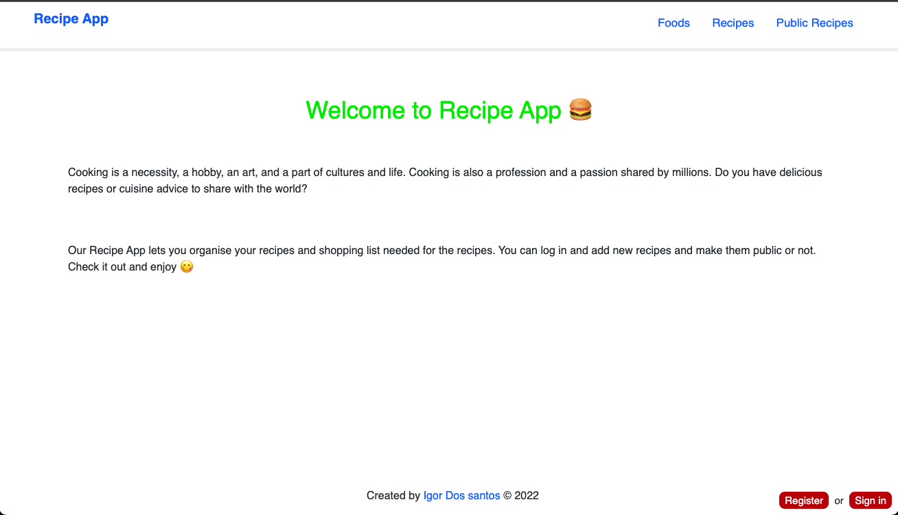
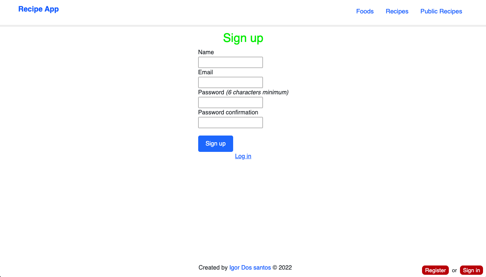
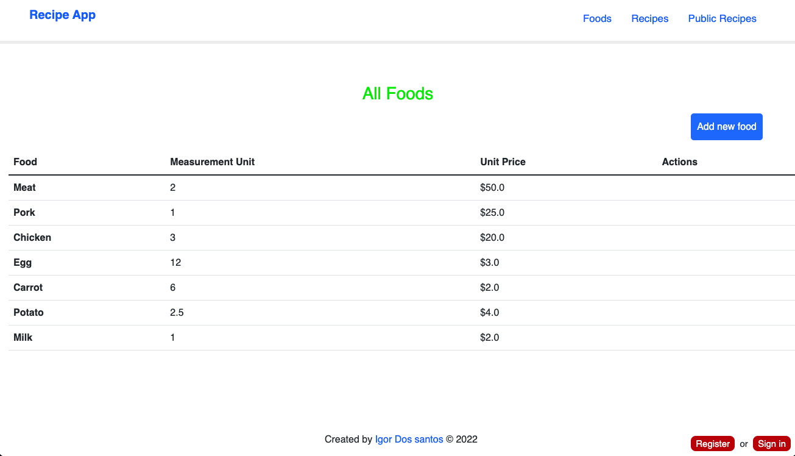
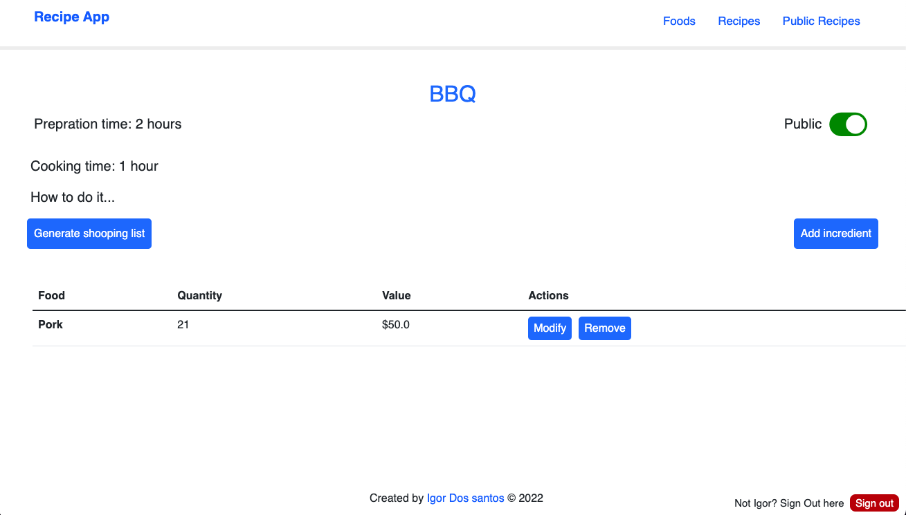

# Recipe-App

> The Recipe app is a classic example of a recipe website. It's a functional website that shows the list of foods and recipes and empower readers to interact with them by adding new foods and recipes. Users can access the services of the application by creatinf a new account or by login in if they already have account.

## Preview

### Home Page



### Sign-up Page



### Foods Page



### Recipe-details page



### Shopping-list page


## Built With

- Major languages (Ruby)
- Framworks (Ruby on Rails)
- Testing libraries(Rspec)
- Markup (HTML)
- Styles (CSS, Bootstrap)

## Live version


## Getting Started

To get a local copy up and running follow these simple example steps.

### Prerequisites
- A text editor(preferably Visual Studio Code)

### Install
- Ruby
- Ruby on Rails
- PostgresSQL
- Rspec

### Using it Locally

### Setup

Install gems with:

```
bundle install
```

Setup database with:

```
rails db:create
rails db:migrate
```

### Usage

Start server with:

```
rails server
```

Visit http://localhost:3000/ in your browser.

### Run tests

Install npm with:

```
npm i
```

Install rspec with:

```
bundle install
```

and

```
rails generate rspec:install
```

run the test with:

```
rspec spec
```

### Open API documentation

```
Coming soon!
```


## Visit 

[Visit Repo](https://github.com/Igor-dos-santos)


## Author

👤 **Igor Dos Santos**

- GitHub: [@Igor-dos-santos](https://github.com/Igor-dos-santos)
- LinkedIn: [@igor-dos-santos](https://www.linkedin.com/in/igor-dos-santos/)# My_Recipe_App
