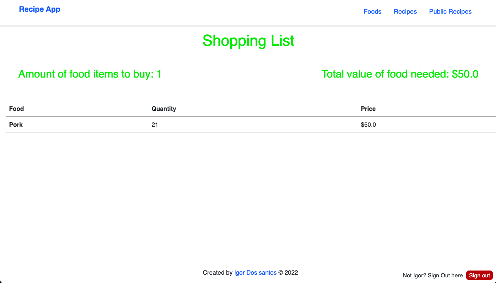

# Recipe-App

> This recipe app is a simple recipes website where users can log in and out, add new 
ingredients to their profiles and add recipes. They have the option of making the recipes 
public or not and that will either display them on the public section to allow users not logged in to see the recipes. Logged in users can also see the amount of their shopping lists to cook a recipe based on the ingredients added by them.

## Preview

### Home Page

### Sign-up Page

### Foods Page

### Recipe-details page

### Shopping-list page

## Built With

- Major languages (Ruby)
- Framworks (Ruby on Rails)
- Testing libraries(Rspec)
- Markup (HTML)
- Styles (CSS, Bootstrap)

## Live version

## Visit 

[Visit Repo](https://github.com/Igor-dos-santos/My_Recipe_App)

## Author

👤 **Igor Dos Santos**

- GitHub: [@Igor-dos-santos](https://github.com/Igor-dos-santos)
- LinkedIn: [@igor-dos-santos](https://www.linkedin.com/in/igor-dos-santos/)

# My_Recipe_App
